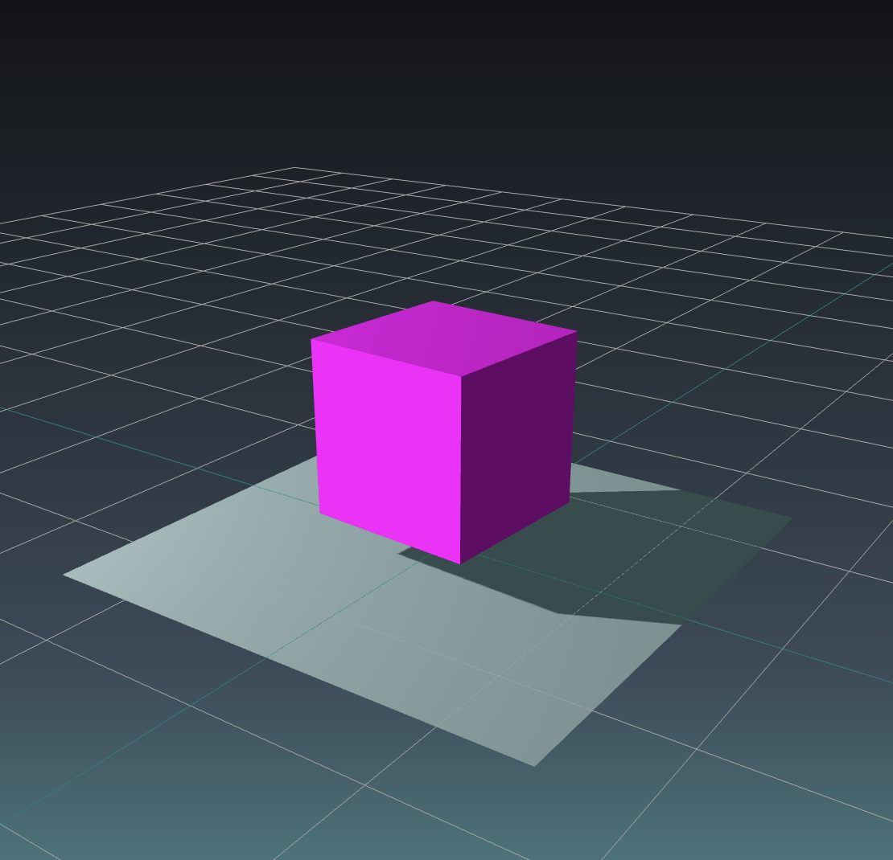

# Three.js Vite Template with TypeScript

Three.js + Vite + TypeScript starter

- [Demo](https://vite-threejs-ts-template.vercel.app/)
- [Jump to CLI commands](#cli-commands)

<div style="text-align: center;">
  
</div>

## Stuff included in the `scene.ts`

- [x] Geometry
- [x] Material
- [x] Mesh
- [x] Ambient Light
- [x] Point Light
- [x] Camera
- [x] Scene
- [x] Canvas
- [x] Renderer (WebGL)
- [x] Loading Manager
- [x] Orbit Controls
- [x] Drag Controls
- [x] Grid
- [x] Antialias enabled
- [x] Transparent canvas
- [x] Responsive renderer and camera (to canvas size)
- [x] Animation Loop
- [x] Shadows
- [x] Stats (FPS, ms)
- [x] Full screen (double-click on canvas)
- [x] Debug GUI

## Tech Stack

- Three.js
- TypeScript
- Vite

## CLI Commands

Installation

```bash
npm i
```

Run dev mode

```bash
npm run dev
```

Build

```bash
npm run build
```

Run build

```bash
npm run preview
```
